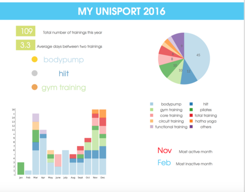

# Infographics of your Unisport trianing records

## Example

My 2016 Unisport training records:

## Usage

(This tools requires credentials of your university account)

### Generating statistis

    >>> python main.py --username {your univ username} --password {your univ passwd} --school  {aalto|uh} --gender {male|female}

The output: 

- Two plots will be generated under `imgs`
- `defines.tex` containing the meta information

### Generating PDF file

    >>> pdflatex poster.tex

## Dependency solving

### Routine

    >>> virtualenv -p python3 venv
    >>> source bin/activate
    >>> pip install -r requirements.txt
    
### Tops on installing `pygal`

To correctly run `pygal` (the plotting library), make sure `libffi` and `libffi-dev` are installed.

For example: 

    sudo apt install libffi libffi-dev
    

